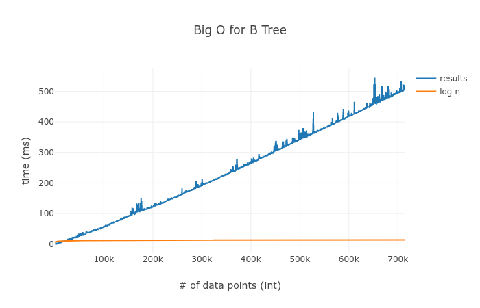

This repository is full of useful data structures that I have made for classes or just for other programs I have made. I have a hankering for speed and the only prescription is getting as close to log(n) as I can.

I have been okay at this with my b_tree

    

